# 把地种好，把日子过稳

## ——稳定承包背景下安徽农户持续种粮的约束结构

**副标题：2025年2079户主实证与2026年570户、38村（合计608份）并列证据**

**报告日期：2026年8月26日**

## 摘要

稳定承包关系回答了“土地权利能否保持稳定”，但没有自动回答“谁来种、怎样种、是否划算、遇到风险能否继续种”。本报告以2025年2079份农户问卷为主实证，以2026年570份农户问卷和38份村级问卷（合计608份）作为并列证据，沿着“制度预期—家庭禀赋—土地与合同—社会化服务—收益风险—未来安排”的机制链，分析安徽农户持续种粮所面对的约束结构。

2025年有效回答中，8.23%报告存在撂荒。无惩罚二项Logit的完整案例为2055户。控制经营面积、地块数、受灾、农业收入和非农收入后，务农劳动力每增加1人对应的撂荒优势比为1.013，95% bootstrap区间为0.868—1.172；受灾对应的优势比为1.940，区间为1.381—2.656。这些结果刻画了控制家庭与经营条件后的关联结构。2026年农户端显示，73.39%的有效回答者表示接受过政策宣讲，但“完全清楚”政策的比例为25.18%；在满足流转资格并排除相关逻辑矛盾的229户中，全部签订正式合同者占34.50%；至少使用部分托管服务者占60.96%。村级端有48.65%报告二轮延包全部完成，42.86%报告统一使用规范合同模板，22.22%报告托管服务全覆盖。

报告的核心判断是：稳定承包是持续种粮的权利底座，但从“权利在手”到“经营有底”，还需要合同规范、适配小地块的服务网络、可承受的生产成本、基础设施和灾害恢复机制。县域治理由土地权利稳定、关键农时服务、可核验合同与灾后恢复能力共同构成结果指标。

**关键词：** 土地承包稳定；持续种粮；耕地撂荒；农业社会化服务；合同治理；农户画像；安徽

## 目录

- 一、研究背景与问题
- 二、数据基础与分析框架
- 三、模型构建与统计方法
- 四、2025年主实证结果
- 五、农户画像与分类接口
- 六、2026年农户端与村级端证据
- 七、从约束结构到县域治理
- 八、结论与研究局限
- 参考文献
- 附录A　2026年农户问卷
- 附录B　2026年村干部问卷
- 附录C　2025年农户问卷（按原始答卷字段反推）
- 附录D　调研过程实拍

## 一、研究背景与问题

### 1. 从权利稳定走向经营稳定

农村土地权利稳定降低了经营基础的不确定性，并通过长期投入、土地交易和家庭劳动力配置进入农户的经营决策[1-4]。稳定承包由此构成持续经营的权利底座，交易环境、家庭资源和地方执行条件共同决定这一底座如何转化为现实经营能力。

土地流转与农业社会化服务形成两条相互补充的经营接续路径。服务帮助劳动力不足、地块较小的家庭保留经营；流转帮助有调整需求的家庭实现有序衔接。两者能否形成互补，取决于合同质量、服务价格、作业及时性、地块适配和纠纷处理[5-8]。已有关于细碎化、劳动力迁移与撂荒的研究进一步表明，撂荒往往是收益、距离、基础设施、劳动供给和服务可得性共同作用的结果[9-12]。

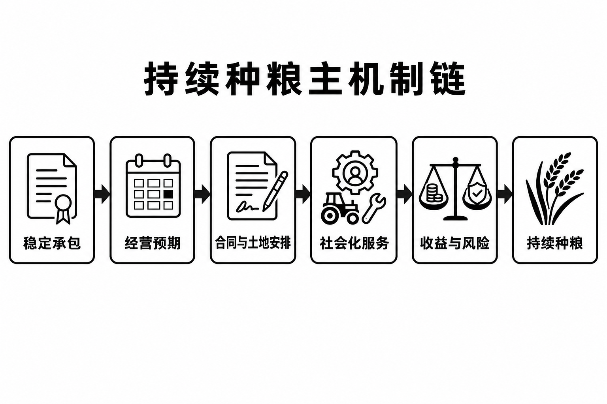

*图1-1　持续种粮主机制链。稳定承包通过经营预期、合同与土地安排、社会化服务和收益风险进入农户的持续种粮决策。方法：机制归纳；来源：本报告研究框架与文献[1-12]。*

### 2. 经营稳定的收入语境

2021—2025年，安徽省农村居民人均可支配收入由18,372元增长至23,828元，城乡居民收入比由2.34缩小至2.17。收入持续增长和差距收窄，为稳定经营、农业服务可及与收益保障之间的衔接提供了省域发展语境[13]。

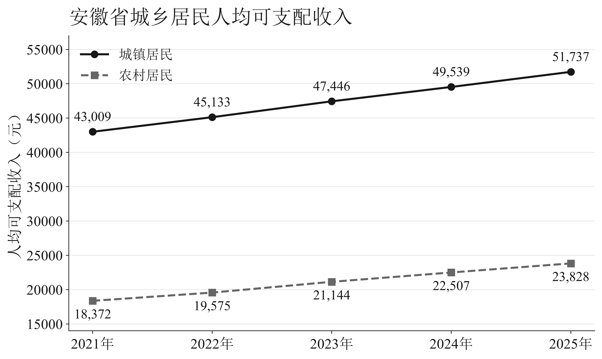

*图1-2　安徽省城乡居民人均可支配收入。口径：常住地口径的全省居民人均可支配收入，单位为元；方法：依据官方统计公报图表公开数值重绘；来源：安徽省统计局、国家统计局安徽调查总队[13]，数据见 `figure_data/fig1-2_ah_urban_rural_income.csv`。*

### 3. 本报告回答的三个问题

第一，在2025年农户样本中，劳动力、经营规模、地块数量、灾害和家庭收入结构与撂荒之间呈现怎样的条件关联？

第二，2026年正式问卷中，延包政策从宣传到理解、从土地流转到合同、从服务存在到农户实际使用，中间在哪些环节出现落差？

第三，在保留家庭多样经营选择的前提下，县域应如何针对稳定自种、服务替代、规模调整和退出压力四类处境配置政策工具？

本报告采用“描述性发现—条件关联—机制解释—政策建议”四级表达：描述性比例呈现样本状态，Logit和稳健回归刻画控制条件下的共同变化，机制部分结合既有研究解释作用路径，政策建议明确执行主体和可考核结果。

## 二、数据基础与分析框架

### 1. 三套数据的证据定位

| 数据 | 规模 | 证据定位 | 主要分析 |
|---|---:|---|---|
| 2025年农户问卷 | 2079户、154列 | 家庭经营与撂荒的主实证 | Logit、Huber、多口径检验、农户画像 |
| 2026年农户问卷 | 570户、36列 | 政策认知、合同、托管与未来安排 | 题项相关有效分母下的描述统计 |
| 2026年村级问卷 | 38村、36列 | 延包、合同模板、服务覆盖与设施约束 | 村级描述统计与户村并列观察 |

2026年数据由原始1,800户、120村按15:1的户村比例收敛至570户、38村，合计608份；保留记录的作答内容不作改写。抽样方法、固定种子、原始行号、质量口径和结论方向校验见受控归档中的《2026年比例收敛抽样说明》。旧规模仅作为本次收敛的来源历史，不代表现行分析样本。

### 2. 有效样本与题项分母

2026年农户表的核心有效样本为564户，村级表的核心有效样本为37村。空序号、重复序号和提交时间解析异常进入核心排除规则；合同指标进一步按流转资格和经营模式一致性确定有效分母，政策认知、未来规划和成本约束分别按相关题项确定有效分母。答题时长低于120秒的记录进入敏感性列，用于观察快速答卷排除前后的指标变化。

2025年主表保留2079户，主模型采用变量完整案例。经营面积使用问卷填报口径，并同步比较排除680条面积恒等式异常、排除任一质量标记以及两种替代经营面积定义的结果。五种口径共同呈现面积定义与质量规则对结论稳定性的影响。

### 3. 并列证据框架

2025年资料承担家庭经营结构的主实证，2026年农户端承担政策认知、合同、服务与未来安排的观察，村级端承担治理供给与基础设施的观察。户级与村级指标按各自有效样本并列呈现，共同定位政策链条中的触达、合同、服务和设施环节。抽样比例、群组结构与多层分析的适用条件见文献[14-15]。

## 三、模型构建与统计方法

### 1. 撂荒模型

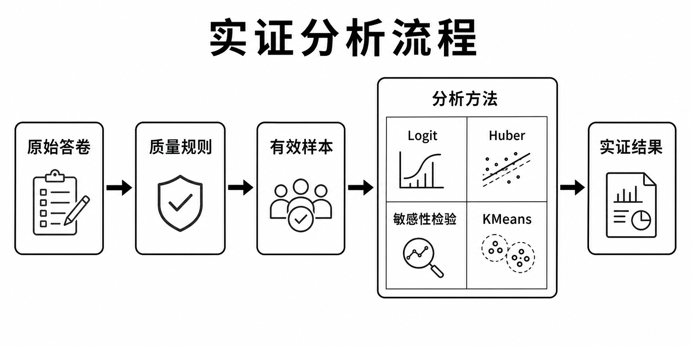

*图3-1　实证分析流程。原始答卷依次经过质量规则与有效样本筛选，再进入Logit、Huber、多口径检验和KMeans分析。方法：流程归纳；来源：v2验证分析结果及本报告模型设计。*

令 \(Y_i=1\) 表示第 \(i\) 户报告存在耕地撂荒，主模型见式（1）：

$$
\operatorname{logit}\Pr(Y_i=1)
=\beta_0+\beta_1L_i+\beta_2\ln(1+A_i)+\beta_3P_i+\beta_4D_i
+\beta_5\ln(1+I_i^{ag})+\beta_6\ln(1+I_i^{nonag}).
\tag{1}
$$

其中，\(L_i\) 为家庭常年务农劳动力人数，\(A_i\) 为经营面积，\(P_i\) 为经营地块数，\(D_i\) 为是否受灾，\(I_i^{ag}\) 和 \(I_i^{nonag}\) 分别为农业纯收入和非农收入。面积和收入采用 \(\ln(1+x)\) 变换以减弱长尾值影响。模型不加惩罚项，通过Newton—Raphson/IRLS求解。

式（1）的系数按式（2）转换为优势比：

$$
OR_j=\exp(\beta_j).
\tag{2}
$$

当 \(OR_j>1\) 时，该变量增加与撂荒优势上升相联系；当 \(OR_j<1\) 时则相反。置信区间来自固定随机种子的2000次有放回重抽样百分位区间。优势比用于比较控制条件下撂荒优势的相对变化。

### 2. 连续结果的稳健回归

对农业收入和粮食面积占经营面积两个连续结果，使用式（3）的Huber稳健回归：

$$
\widehat{\boldsymbol{\beta}}
=\arg\min_{\boldsymbol{\beta}}
\sum_{i=1}^{n}\rho_{\delta}\left(y_i-\mathbf{x}_i^{\mathsf T}\boldsymbol{\beta}\right),
\tag{3}
$$

其中解释变量先标准化，\(\rho_{\delta}\) 对小残差使用平方损失、对大残差使用线性增长，从而降低极端报告值对系数的支配。连续模型与主模型共同刻画经营收入、粮食面积结构和撂荒状态的多维关系。

### 3. 统计画像的构建

画像矩阵按式（4）由经过对数变换、1%—99%缩尾和标准化的数值变量，与类别变量独热编码拼接得到：

$$
\mathbf{X}
=\left[
\operatorname{Z}\{\operatorname{Winsor}(\ln(1+\mathbf{X}_{num}))\}
\;\middle|\;
\operatorname{OneHot}(\mathbf{X}_{cat})
\right].
\tag{4}
$$

四类画像通过式（5）所示的类内平方距离目标获得：

$$
\min_{\{c_i\},\{\boldsymbol{\mu}_k\}}
\sum_{i=1}^{n}\left\|\mathbf{x}_i-\boldsymbol{\mu}_{c_i}\right\|_2^2.
\tag{5}
$$

聚类稳定性采用bootstrap重抽样检验：每次重新抽取样本、拟合聚类中心，再对完整分析矩阵重新分配类别，并以调整兰德指数（ARI）与基准分配比较。画像名称依据各类相对特征赋予，用于连接统计分组与分类政策接口。

| 变量 | 列序号 | 编码或单位 | 用途 |
|---|---|---|---|
| 撂荒 | 104 | 1=是，2=否 | Logit因变量 |
| 务农劳动力 | 69 | 人数 | 家庭劳动禀赋 |
| 经营面积 | 97 | 亩，模型取ln(1+x) | 经营规模 |
| 承包地面积 | 98 | 亩 | 面积敏感性口径 |
| 转入/转出面积 | 99/100 | 亩 | 面积敏感性口径 |
| 托管面积 | 101 | 亩 | 替代面积与画像 |
| 地块数 | 102 | 块 | 细碎化代理 |
| 受灾 | 135 | 1=是，2=否 | 风险暴露 |
| 农业纯收入 | 152 | 万元，模型取ln(1+x) | 经营结果/控制变量 |
| 非农收入 | 153 | 万元，模型取ln(1+x) | 家庭机会结构 |

## 四、2025年主实证结果

### 1. 撂荒呈现多路径经营结构

图4-1呈现撂荒、转入、转出和托管四种非互斥经营状态，反映家庭通过扩大、收缩、服务替代和经营接续形成的多条调整路径。

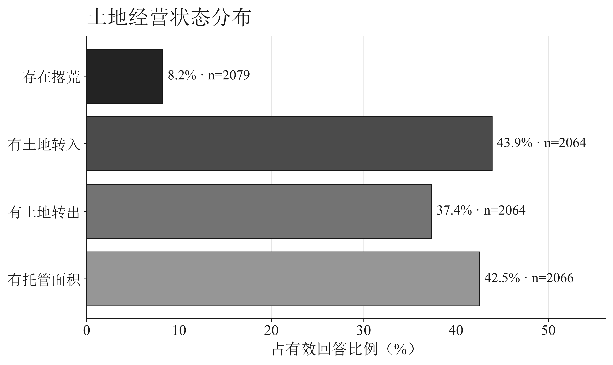

*图4-1　土地经营状态分布。口径：各状态按对应题项有效回答计算，状态互不排斥；有效样本为2079户或2064—2066户；方法：描述统计；来源：2025年农户问卷，数据见 `figure_data/fig4-1_land_status.csv`。*

图4-2进一步展示不同务农劳动力组的撂荒比例，为家庭劳动禀赋与经营接续之间的关系提供分组观察。

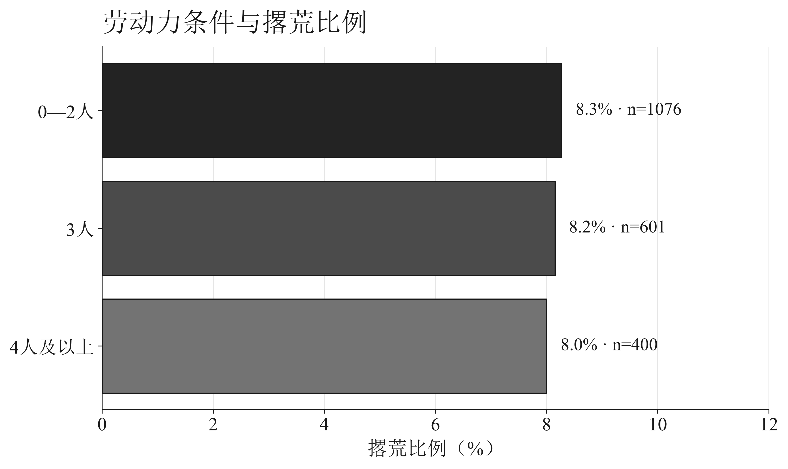

*图4-2　劳动力条件与撂荒比例。口径：按务农劳动力人数分组计算撂荒比例；各组有效样本见图中直接标签；方法：分组描述统计；来源：2025年农户问卷，数据见 `figure_data/fig4-2_labor_fallow.csv`。*

### 2. 条件关联：灾害风险比单纯面积更值得警惕

表1和图4-3给出主模型结果。务农劳动力的OR为1.013（95%区间0.868—1.172）；经营面积采用 \(\ln(1+\text{亩数})\) 刻度，其OR为0.825（0.672—0.963）；受灾OR为1.940（1.381—2.656）。区间是否跨过1及其宽度共同反映估计方向与精度。

图4-4把其余变量固定在样本中位数，分别计算报告受灾和未报告受灾情景下，经营面积变化对应的模型预测概率，直观呈现面积与灾害暴露组合下的条件概率曲线。

| 变量 | OR | 95%区间下限 | 95%区间上限 | n |
|---|---|---|---|---|
| 家庭务农劳动力（每增加1人） | 1.013 | 0.868 | 1.172 | 2055 |
| ln(1+经营面积) | 0.825 | 0.672 | 0.963 | 2055 |
| 地块数（每增加1块） | 1.002 | 0.999 | 1.007 | 2055 |
| 受灾（是/否） | 1.940 | 1.381 | 2.656 | 2055 |
| ln(1+农业收入) | 1.006 | 0.865 | 1.138 | 2055 |
| ln(1+非农收入) | 1.030 | 0.918 | 1.155 | 2055 |

*表1　2025年撂荒无惩罚二项Logit结果。区间为2000次bootstrap百分位区间。*

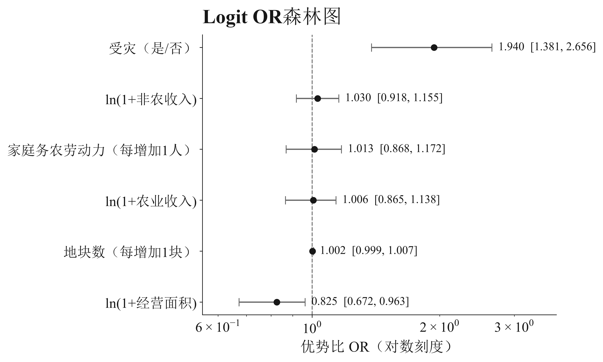

*图4-3　Logit OR森林图。口径：撂荒完整案例2055户；方法：无惩罚二项Logit与2000次bootstrap百分位区间，横轴为OR对数刻度；来源：2025年农户问卷，数据见 `figure_data/fig4-3_logit_or.csv`。*

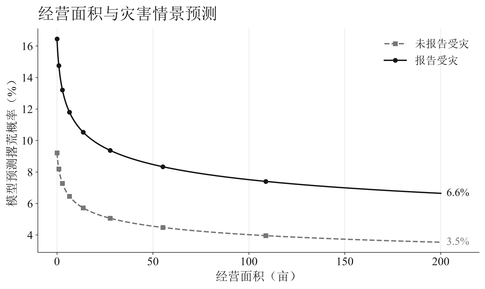

*图4-4　经营面积与灾害情景预测。口径：其余协变量固定在样本中位数；有效样本为2055户；方法：基于主Logit模型的条件预测；来源：2025年农户问卷，数据见 `figure_data/fig4-4_area_disaster_prediction.csv`。*

关于撂荒和服务的既有研究表明，劳动力迁移、细碎化、服务供给、地块距离和比较收益常常共同出现，且地区、作物和服务环节会带来异质性[9-12]。安徽样本中的灾害关联将政策重点指向灌排、技术、保险和下一季生产接续的组合支持。

### 3. 多口径结果呈现关系稳健性

| 口径 | n | 撂荒比例(%) | 劳动力OR | 面积OR | 受灾OR | 状态 |
|---|---|---|---|---|---|---|
| 主模型：填报经营面积 | 2055 | 8.03 | 1.013 | 0.825 | 1.940 | PASS |
| 排除任一2025质量标记 | 980 | 5.92 | 1.046 | 0.912 | 1.421 | PASS |
| 排除680条面积恒等式异常 | 1377 | 7.04 | 1.035 | 0.669 | 1.549 | PASS |
| 替代面积：承包+转入-转出 | 2054 | 8.03 | 0.999 | 0.869 | 1.931 | PASS |
| 替代面积：承包+转入-转出+托管 | 2054 | 8.03 | 0.997 | 0.848 | 1.932 | PASS |

*表2　经营面积和质量规则敏感性检验。替代面积口径分别检验托管面积是否计入经营构成。*

表2列出五种可复核口径。灾害变量在多种面积定义和质量规则下保持同向，经营面积的估计幅度随口径变化。多口径结果把稳定方向与口径差异同时呈现，为政策解释提供更清晰的优先次序。

## 五、农户画像与分类接口

### 1. 四类经营画像呈现差异化处境

画像分析使用2025年匿名统计变量，将劳动、面积、地块、收入和经营安排压缩为四类经营处境。图5-1展示从变量处理、聚类分组到分类政策接口的完整流程；图5-2与图5-3分别呈现标准化特征和群体规模，表3公开各类原始量纲指标。

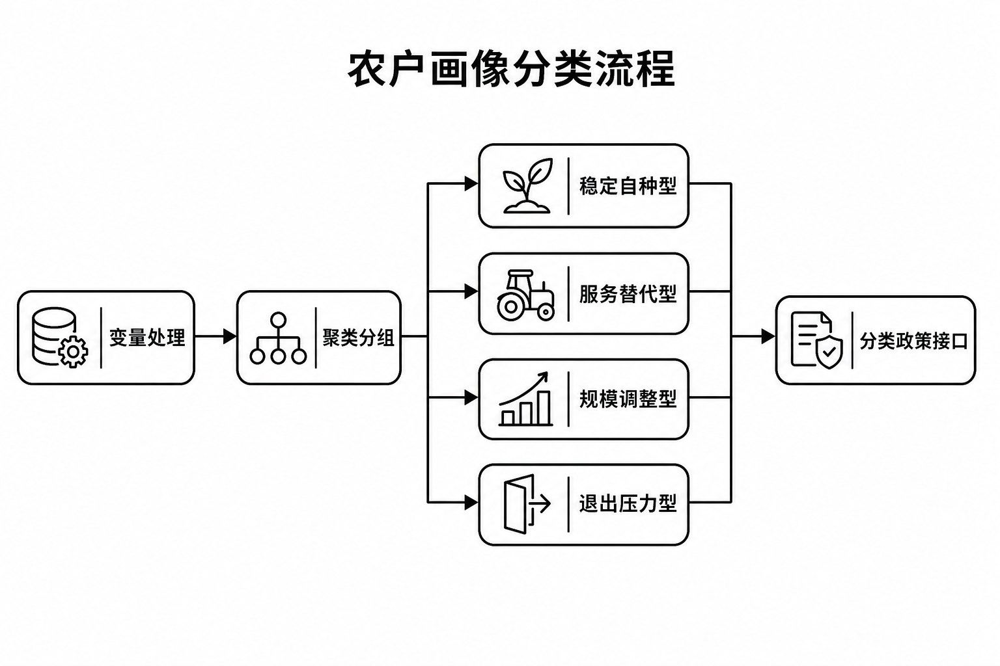

*图5-1　农户画像分类流程。变量处理后由KMeans形成四类经营画像，并连接差异化政策接口。方法：流程归纳；来源：2025年农户问卷画像模型。*

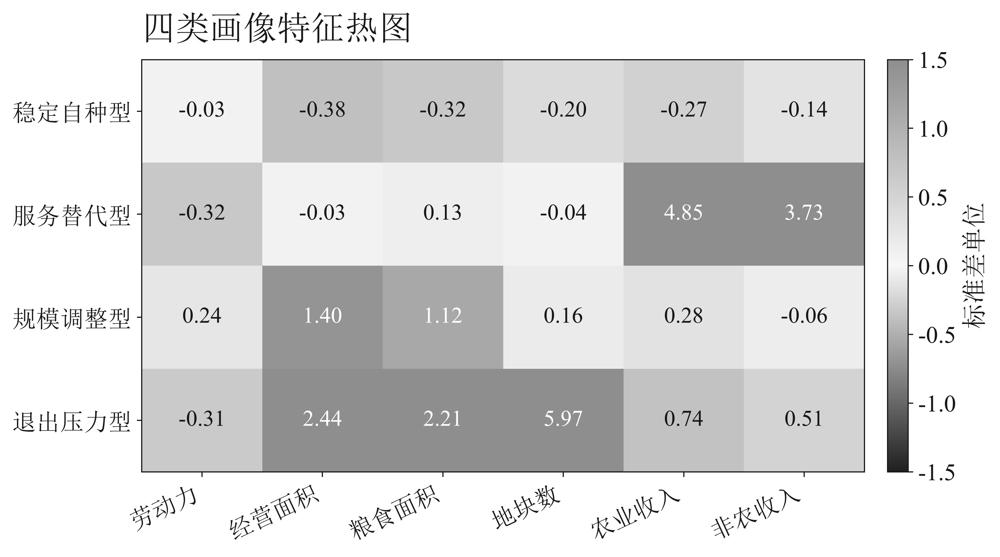

*图5-2　四类画像特征热图。口径：连续变量经对数变换、缩尾和标准化；有效样本为2053户；方法：KMeans类内标准化均值比较；来源：2025年农户问卷，数据见 `figure_data/fig5-2_profile_heatmap.csv`。*

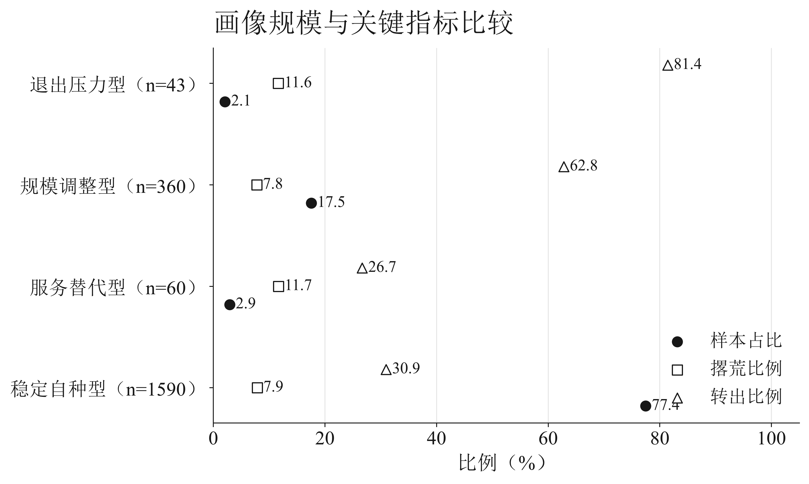

*图5-3　画像规模与关键指标比较。口径：各画像内样本占比、撂荒和转出比例；有效样本为2053户；方法：聚类后分组描述统计；来源：2025年农户问卷，数据见 `figure_data/fig5-3_profile_metrics.csv`。*

| 画像 | n | 占比(%) | 务农劳动力 | 经营面积中位数 | 撂荒(%) | 有托管面积(%) | 有转出(%) |
|---|---|---|---|---|---|---|---|
| 稳定自种型 | 1590 | 77.45 | 2.0 | 5.0 | 7.86 | 34.97 | 30.94 |
| 服务替代型 | 60 | 2.92 | 2.0 | 8.0 | 11.67 | 38.33 | 26.67 |
| 规模调整型 | 360 | 17.54 | 3.0 | 50.0 | 7.78 | 71.11 | 62.78 |
| 退出压力型 | 43 | 2.09 | 2.0 | 380.0 | 11.63 | 83.72 | 81.40 |

*表3　画像规模与关键特征。名称根据聚类后观察到的相对特征赋予。*

### 2. 画像对应怎样的政策接口

**稳定自种型**需要稳定的基础作业、农资和灾害服务。政策考核聚焦关键农时服务准时率、灾后恢复和家庭经营连续性。

**服务替代型**通过耕、种、管、收的部分或全程服务替代家庭短缺的劳动。服务价格、预约等待时间、适配小地块的设备和质量回访，是比“是否有服务主体”更具体的指标。

**规模调整型**需要合同、烘干仓储、保险、订单和资金周转的组合，以匹配经营面积扩大后的土地组织、收益和风险管理需求。

**退出压力型**需要规范流转、代耕接续和纠纷咨询，使转出、托管或阶段性调整具备清楚的权利和责任边界。

## 六、2026年农户端与村级端证据

### 1. 政策宣讲进一步转化为政策理解

2026年农户端，接受过政策宣讲者占73.39%，完全清楚延包政策者占25.18%。政策宣讲进一步转化为政策理解，重点落在延包期限、权利边界、流转合同和纠纷处理等可操作内容。中央关于延包试点的政策和工作规程强调稳定关系、规范程序与保障权益[16-17]，地方执行由信息送达继续延伸到理解确认。

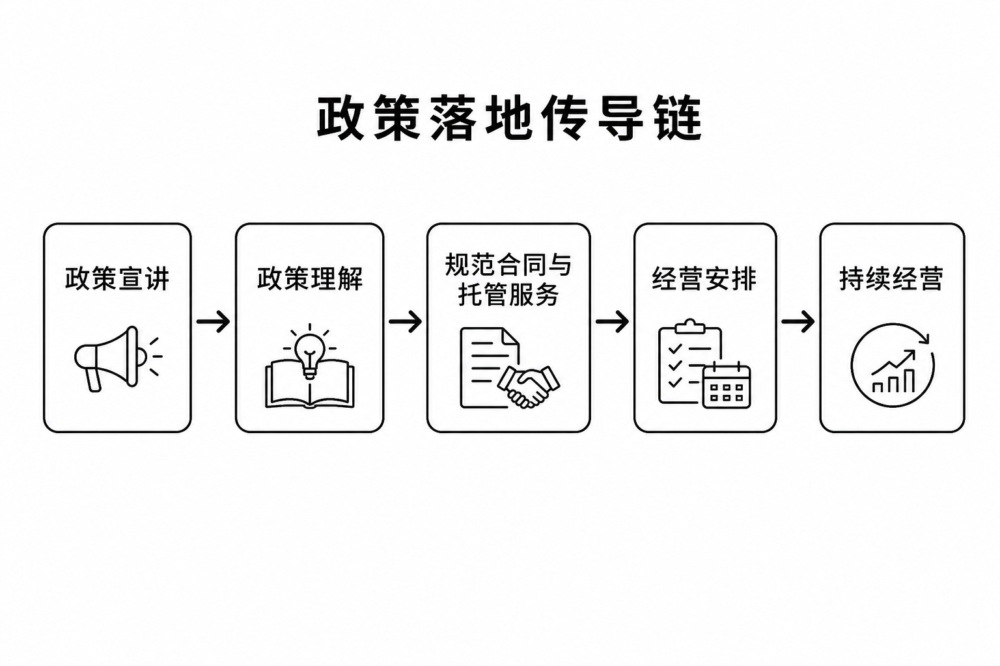

*图6-1　政策落地传导链。政策宣讲经由政策理解、规范合同与托管服务进入经营安排和持续经营。方法：机制归纳；来源：2026年农户端与村级端问卷及政策文献[16-18]。*

图6-2并列呈现政策认知与未来三年安排。18.04%计划扩大粮食种植，25.54%计划逐步转出土地，分别对应经营支持与规范流转、经营接续两类政策需求。

### 2. 合同和服务是从权利稳定走向经营稳定的中间层

合同率以229户有效流转样本为分母，全部签订正式合同者占34.50%。合同治理涵盖期限、租金、续租、违约责任和争议处理。农业社会化服务政策连接小农户、现代生产要素和质量责任[18]；样本中至少使用部分托管服务者占60.96%。图6-3呈现合同、托管和增收约束，表4同步公开主分析与短时答卷敏感性分母。

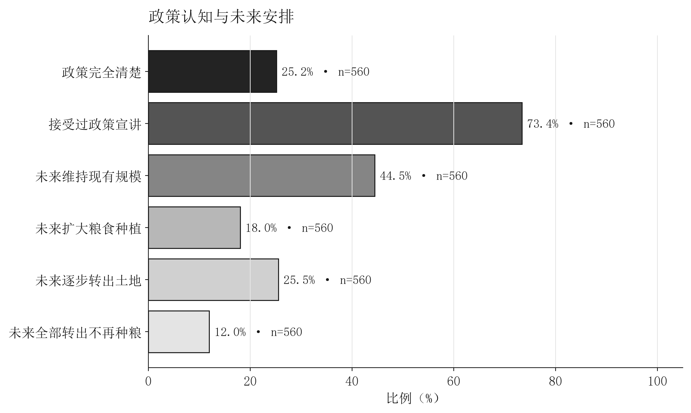

*图6-2　政策认知与未来安排。口径：各指标按相关题项有效回答计算；有效样本为560户；方法：描述统计；来源：2026年农户问卷，数据见 `figure_data/fig6-2_policy_future.csv`。*

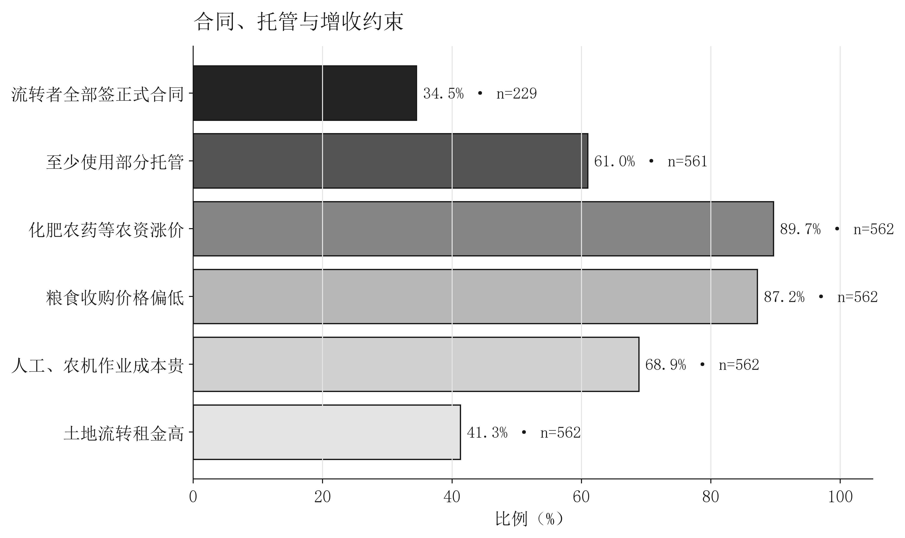

*图6-3　合同、托管与增收约束。口径：合同率以229户有效流转样本为分母，托管使用以561户为分母，多选增收约束以562户为分母；方法：条件分母描述统计；来源：2026年农户问卷，数据见 `figure_data/fig6-3_contract_service_constraints.csv`。*

| 指标 | 主分析n | 主分析(%) | 排除短时n | 排除短时(%) | 分母规则 |
|---|---|---|---|---|---|
| 政策完全清楚 | 560 | 25.18 | 485 | 25.36 | 核心有效且政策认知题非空 |
| 接受过政策宣讲 | 560 | 73.39 | 485 | 72.16 | 核心有效且宣传题非空 |
| 流转者全部签正式合同 | 229 | 34.50 | 194 | 34.02 | 核心有效、流转面积>0、合同题非空，并排除流转面积及经营模式矛盾 |
| 至少使用部分托管 | 561 | 60.96 | 486 | 60.29 | 核心有效且托管题非空 |
| 未来维持现有规模 | 560 | 44.46 | 485 | 44.12 | 核心有效且未来规划题非空 |
| 未来扩大粮食种植 | 560 | 18.04 | 485 | 17.11 | 核心有效且未来规划题非空 |
| 未来逐步转出土地 | 560 | 25.54 | 485 | 25.77 | 核心有效且未来规划题非空 |
| 未来全部转出不再种粮 | 560 | 11.96 | 485 | 12.99 | 核心有效且未来规划题非空 |

*表4　2026年农户端核心指标及答题时长敏感性。主分析排除核心无效记录；合同指标另排除相关流转矛盾。*

### 3. 村级端呈现组织和基础设施容量

村级端有48.65%报告二轮延包全部完成，42.86%报告统一使用规范合同模板，22.22%报告托管服务全覆盖。与此同时，75.68%的有效回答把土地细碎化列为粮食增产增收约束，59.46%提到水利或机耕路不足。高标准农田研究显示，建设质量、设施连通、机械适配和后续管护共同影响粮食生产能力[19-20]。表5列明村级指标及敏感性分母，图6-4展示治理与设施约束，图6-5呈现户级感知与村级供给的并列观察。

| 指标 | 主分析n | 主分析(%) | 排除短时n | 排除短时(%) | 分母规则 |
|---|---|---|---|---|---|
| 二轮延包全部完成 | 37 | 48.65 | 33 | 45.45 | 核心有效且延包进度题非空 |
| 统一使用规范合同模板 | 35 | 42.86 | 31 | 38.71 | 核心有效、合同题非空，并排除流转面积矛盾 |
| 托管服务全覆盖 | 36 | 22.22 | 33 | 21.21 | 核心有效且托管覆盖题非空 |
| 约束包含土地细碎化 | 37 | 75.68 | 33 | 78.79 | 核心有效且村级约束题非空 |
| 约束包含水利或机耕路不足 | 37 | 59.46 | 33 | 57.58 | 核心有效且村级约束题非空 |
| 按季度开展农技或政策宣讲 | 37 | 40.54 | 33 | 42.42 | 核心有效且村级宣讲题非空 |

*表5　2026年村级端核心指标及答题时长敏感性。*

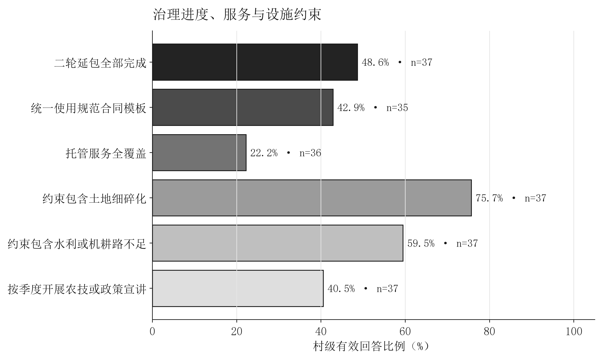

*图6-4　村级治理与基础设施。口径：各指标按村级相关题项有效回答计算；有效样本为35—37村；方法：描述统计；来源：2026年村干部问卷，数据见 `figure_data/fig6-4_village_governance.csv`。*

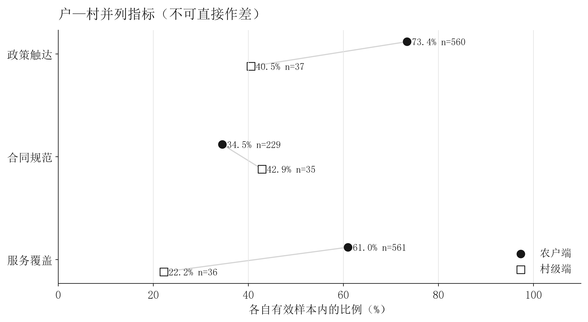

*图6-5　户级与村级指标并列比较。口径：户级指标按229—561户的各自有效样本计算，村级指标按35—37村的各自有效样本计算，两端指标不可直接作差；主题包括政策触达、合同规范和服务覆盖；方法：并列证据矩阵；来源：2026年农户问卷与村干部问卷，数据见 `figure_data/fig6-5_household_village_parallel.csv`。*

户级与村级指标构成同一政策链上的两个观察窗口。农户端合同规范率与村级统一模板比例共同指向合同供给、解释和实际签订环节；政策触达与托管服务指标共同指向组织供给向家庭经营转化的关键节点。

## 七、从约束结构到县域治理

### 1. 县级：把分散政策编成经营服务包

种粮农民收益保障由价格、成本、保险、服务和灾后恢复共同构成[21]。县级可依托农事综合服务中心或同类平台，把延包咨询、合同范本、服务主体、参考价格、保险办理和纠纷渠道组织成一张清单。每项服务要写清联系人、办理条件、价格或补助边界、处理时限和投诉路径。

结果指标至少包括：政策理解率而非仅宣传覆盖率；条件流转户正式合同率而非全部农户合同率；关键农时作业准时率而非累计服务面积；灾后恢复时长而非只统计理赔件数；小地块服务覆盖而非只统计服务主体数量。

### 2. 乡镇：把“有服务”变成农时内可调度

乡镇适合承担跨村需求汇总和农机调度。播种、植保、排灌和收获都有时间窗口，服务迟到可能使农户即使支付了费用也无法获得预期结果。乡镇可按主要作物和农时建立需求清单，对小地块集中区组织预约，对道路受限地块提前匹配设备，并记录服务延误和补救情况。

### 3. 村级：识别经营断点并组织经营接续

村级台账记录地块层面的劳动力不足、道路不通、服务覆盖、合同状态、灾害受损和暂时撂荒原因，用于安排经营接续和服务调度。村级组织负责需求确认和信息连接，专业主体负责作业与质量，乡镇和县级负责规则、资金与监督。

### 4. 服务主体：从完成面积转向对结果负责

服务合同应明确作业环节、时间、价格、质量、天气调整和补救责任。支持政策可把准时率、投诉闭环、小农户覆盖和价格透明纳入评价。土地流转与社会化服务的互补关系通过可核验的交易规则和质量责任得到落实[5-8]。

### 5. 风险治理：让灾害之后仍有下一季

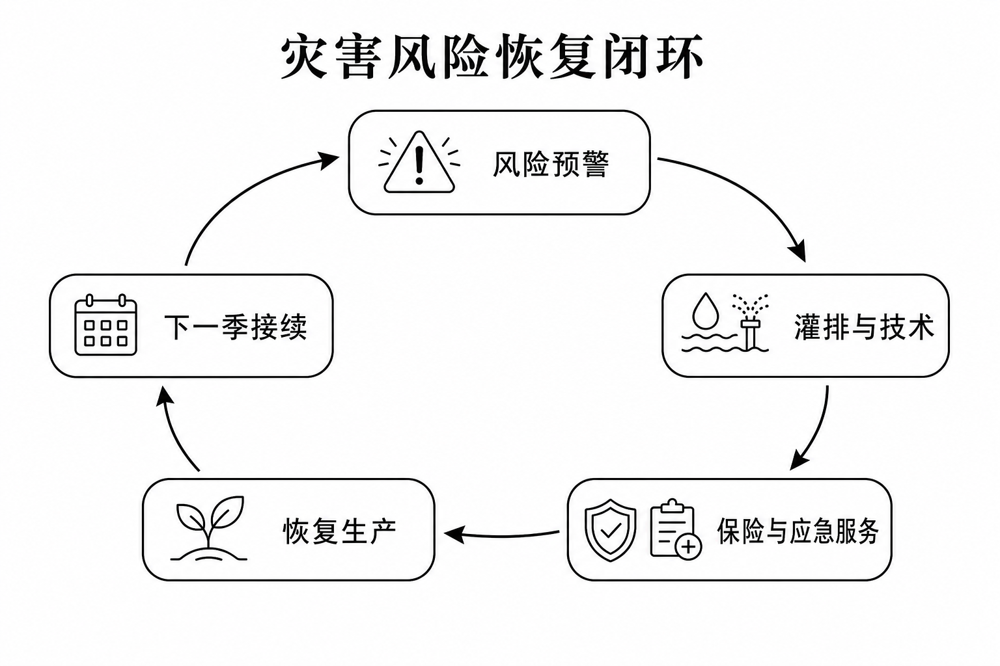

*图7-1　灾害风险恢复闭环。风险预警、灌排与技术、保险与应急服务、恢复生产和下一季接续构成连续治理链。方法：机制归纳；来源：2025年主模型结果与县域风险治理框架。*

受灾关联在模型中较为突出。风险治理由预警、灌排、农技、承保、查勘、理赔、生产周期结算和经营接续共同组成，韧性评价聚焦恢复生产时长与下一季接续情况。

## 八、结论与研究局限

### 1. 结论

本报告最希望保留的不是某一个孤立比例，而是一条完整判断：稳定承包让农户能够保有选择，但选择能否转化为持续种粮，仍取决于劳动力、地块、合同、服务、收益和风险治理。安徽农户面对的不是“种或不种”的抽象选择，而是一连串非常具体的农时问题——谁来完成作业、设备能否进地、合同是否清楚、成本能否承受、灾害后能否重新开始。

这也解释了为什么中国式农业现代化不能只理解为土地集中。服务主体可以跨户形成服务规模，村级组织可以降低协调成本，县域平台可以提供合同、保险和价格信息。小农户即使不扩大面积，也可以通过稳定获得现代要素进入现代农业体系；希望调整的家庭，也应能够在权利不受损的情况下转出或托管。

### 2. 局限

第一，本报告是观察性横截面分析，Logit、稳健回归和画像用于识别条件关联与样本结构，不能识别政策因果。第二，2025年与2026年使用不同问卷，不能写成同口径年度趋势。第三，2026年户表和村表缺少共同village_id，不能实施多层模型或村级政策供给与农户感知的匹配检验，图6-5中的两端指标也不作直接差值解释。第四，2025年经营面积存在较多恒等式异常，虽然已报告敏感性结果，仍应在后续调查中明确托管面积是否计入经营面积；图4-4属于固定其余变量后的条件预测，不代表同一农户扩大面积后的必然变化。第五，画像bootstrap分配ARI均值为0.779，且包含不足5%的小样本类别，只能用于组织政策问题，不能据此推断安徽农户总体类型分布。优势比用于条件关联比较，不等同于风险比或因果效应。

下一轮调查应优先补充匿名户—村键、合同期限与违约责任、服务环节与价格、作业准时和质量、保险理赔时长、地块距离与道路可达性。问卷不必无限加长，但必须让“制度输入—服务过程—家庭结果”能够被同一条匿名证据链连接。

## 参考文献

[1] JACOBY H G, LI G, ROZELLE S. Hazards of expropriation: Tenure insecurity and investment in rural China[J/OL]. American Economic Review, 2002, 92(5): 1420-1447[2026-08-25]. https://www.aeaweb.org/articles?id=10.1257%2F000282802762024575. DOI:10.1257/000282802762024575.

[2] GAO L, SUN D, HUANG J. Impact of land tenure policy on agricultural investments in China: Evidence from a panel data study[J/OL]. China Economic Review, 2017, 45: 244-252[2026-08-25]. https://www.sciencedirect.com/science/article/pii/S1043951X17300962. DOI:10.1016/j.chieco.2017.07.005.

[3] GAO L, HUANG J, ROZELLE S. Rental markets for cultivated land and agricultural investments in China[J/OL]. Agricultural Economics, 2012, 43(4): 391-403[2026-08-25]. https://onlinelibrary.wiley.com/doi/10.1111/j.1574-0862.2012.00591.x. DOI:10.1111/j.1574-0862.2012.00591.x.

[4] 吴佳璇, 王晓兵, 陆岐楠. 新一轮土地确权实施的农村劳动力跨部门配置效应[J/OL]. 中国农村经济, 2025(2): 63-85[2026-08-25]. https://zgncjj.ajcass.com/UploadFile/Issue/201606270007/2025/2/20250225111140WU_FILE_0.pdf.

[5] 钟真, 胡珺祎, 曹世祥. 土地流转与社会化服务：“路线竞争”还是“相得益彰”？——基于山东临沂12个村的案例分析[J]. 中国农村经济, 2020(10): 52-70.

[6] 黄季焜, 徐阳. 促进还是阻碍？农机社会化服务对不同农户经营规模的影响——基于8省农户面板数据的实证研究[J/OL]. 农业经济问题, 2026(3): 3-16, 68[2026-08-25]. https://njwt.cbpt.cnki.net/portal/journal/portal/client/paper/4b2b34f54f4655a7ae794caaa913a7cb. DOI:10.13246/j.cnki.iae.2026.03.002.

[7] 龚燕玲, 张应良, 杨飞韵. “一致性”效应还是“跷跷板”效应——农业社会化服务对粮食产量和粮食种植收益的影响[J/OL]. 西北农林科技大学学报(社会科学版), 2025, 25(2): 107-120[2026-08-25]. https://agri.nais.net.cn/literature/casdd/AD5C1D19-EB96-46F6-AA18-BACACEA814F8.html.

[8] SHEN S, CUI M, ZHENG F. How does land fragmentation affect farmers' decision-making for agricultural socialized services?[J/OL]. Journal of Rural Studies, 2025, 119: 103803[2026-08-25]. https://www.sciencedirect.com/science/article/pii/S074301672500244X. DOI:10.1016/j.jrurstud.2025.103803.

[9] 郑淋议, 陈紫微. 耕地细碎化对农户耕地撂荒的影响及其治理优化[J/OL]. 地理研究, 2024, 43(1): 200-213[2026-08-25]. https://www.dlyj.ac.cn/CN/abstract/abstract55900.shtml. DOI:10.11821/dlyj020230371.

[10] 唐宏, 梁玲婕, 何慧芳, 等. 农业社会化服务与耕地细碎化对耕地撂荒的影响[J/OL]. 自然资源学报, 2024, 39(9): 2171-2187[2026-08-25]. https://www.jnr.ac.cn/CN/10.31497/zrzyxb.20240910. DOI:10.31497/zrzyxb.20240910.

[11] 孙小宇, 杨钢桥. 农业社会化服务对耕地撂荒的抑制效应——理论分析与实证检验[J/OL]. 资源科学, 2024, 46(8): 1554-1569[2026-08-25]. https://www.resci.cn/CN/10.18402/resci.2024.08.08. DOI:10.18402/resci.2024.08.08.

[12] ZHANG Y, TANG A, ZHANG D, et al. What drives farmland abandonment in rural China? A meta-analysis[J/OL]. Habitat International, 2026, 173: 103845[2026-08-25]. https://www.sciencedirect.com/science/article/pii/S0197397526001384. DOI:10.1016/j.habitatint.2026.103845.

[13] 安徽省统计局, 国家统计局安徽调查总队. 安徽省2025年国民经济和社会发展统计公报[EB/OL]. (2026-03-19)[2026-08-26]. https://www.ah.gov.cn/zfsj/tjgblmdz/sjtjgb/565504431.html.

[14] COCHRAN W G. Sampling techniques[M]. 3rd ed. New York: John Wiley & Sons, 1977.

[15] MAAS C J M, HOX J J. Sufficient sample sizes for multilevel modeling[J]. Methodology, 2005, 1(3): 86-92. DOI:10.1027/1614-2241.1.3.86.

[16] 中共中央办公厅, 国务院办公厅. 关于做好第二轮土地承包到期后再延长30年试点工作的意见[EB/OL]. (2026-03-18)[2026-08-25]. https://www.gov.cn/yaowen/liebiao/202603/content_7063137.htm.

[17] 农业农村部办公厅, 自然资源部办公厅, 国家档案局办公室. 关于印发《第二轮土地承包到期后再延长30年试点工作规程》的通知[EB/OL]. (2026-02-05)[2026-08-25]. https://zcggs.moa.gov.cn/nccbdggygl/202603/t20260319_6482444.htm.

[18] 农业农村部. 关于加快发展农业社会化服务的指导意见[EB/OL]. (2021-07-07)[2026-08-25]. https://fgs.moa.gov.cn/flfg/202107/t20210712_6371571.htm.

[19] 陈莉莉, 彭继权. 中国高标准农田建设政策对粮食生产能力的影响及其机制[J/OL]. 资源科学, 2024, 46(1): 145-159[2026-08-25]. https://www.resci.cn/CN/abstract/article/1007-7588/56096. DOI:10.18402/resci.2024.01.11.

[20] 蓝红星. 高标准农田建设的成效与挑战[J/OL]. 人民论坛, 2025(21): 76-81[2026-08-25]. https://paper.people.com.cn/rmlt/pc/content/202511/19/content_30125616.html.

[21] 赵长保. 健全种粮农民收益保障机制 保护农民种粮积极性[EB/OL]. (2024-06-12)[2026-08-25]. https://zcggs.moa.gov.cn/zczc/202406/t20240625_6457782.htm.

## 附录A　2026年农户问卷

### 稳定土地承包关系与粮食生产经营提质增效调查问卷——农户调查问卷

#### 一、家庭基本情况

##### 第1题　您所在区域（单选）
- □ 皖北平原粮食区
- □ 江淮丘陵区
- □ 皖南山地

##### 第2题　家庭常年务农劳动力人数：____人（填空）
____________

##### 第3题　户主年龄（单选）
- □ 45 岁及以下
- □ 46—60 岁
- □ 60 岁以上

##### 第4题　家庭主要收入来源（单选）
- □ 粮食种植为主
- □ 外出务工为主
- □ 土地流转租金
- □ 其他

##### 第5题　家庭全年农业总收入（单选）
- □ 3 万元以下
- □ 3—5 万元
- □ 5 万元以上

#### 二、土地承包与二轮延包情况

##### 第6题　家庭确权登记耕地总面积：____亩（填空）
____________

##### 第7题　是否持有《农村土地承包经营权证》（单选）
- □ 是
- □ 否

##### 第8题　您是否了解二轮土地承包到期再延长 30 年政策（单选）
- □ 完全清楚
- □ 略有耳闻
- □ 完全不了解

##### 第9题　村里是否开展过延包政策宣讲（单选）
- □ 是
- □ 否

##### 第10题　村里是否开展过延包政策宣讲（单选）
- □ 多次宣讲
- □ 简单通知一次
- □ 从未宣传

##### 第11题　自家承包地是否存在地界、流转等权属纠纷（单选）
- □ 无
- □ 有

##### 第12题　您对稳定土地承包关系的态度（单选）
- □ 支持，长期在家种粮
- □ 无所谓，看收益
- □ 打算转出土地不再种地

#### 三、土地流转、托管与耕地撂荒

##### 第13题　自家耕地经营模式（单选）
- □ 全部自己耕种
- □ 部分流转、部分自种
- □ 全部流转给大户 / 合作社
- □ 农业托管服务

##### 第14题　如有流转：流转面积____亩；流转年限（填空）
____________

##### 第15题　土地流转是否签订书面合同（单选）
- □ 全部签正式合同
- □ 仅口头约定

##### 第16题　是否使用耕、种、管、收农业托管服务（单选）
- □ 全程托管
- □ 部分环节托管
- □ 从未使用

##### 第17题　本村是否存在耕地撂荒现象（单选）
- □ 无撂荒
- □ 少量零星撂荒
- □ 较多耕地撂荒

##### 第18题　自家若有撂荒，主要原因（单选）
- □ 务农劳动力不足
- □ 种粮收益太低
- □ 地块零散难耕种
- □ 无撂荒

#### 四、粮食生产成本与收益

##### 第19题　家庭主要种植粮食（多选）
- □ 水稻
- □ 小麦
- □ 大豆

##### 第20题　每亩粮食全年生产总成本（单选）
- □ 1200 元以下
- □ 1200 元以上

##### 第21题　每亩粮食扣除成本后纯收益（单选）
- □ 亏损
- □ 0—600 元
- □ 600 元以上

##### 第22题　制约种粮增收的主要因素（多选）
- □ 化肥农药等农资涨价
- □ 粮食收购价格偏低
- □ 土地流转租金高
- □ 人工、农机作业成本贵

##### 第23题　是否加入种粮农民专业合作社（单选）
- □ 是
- □ 否

#### 五、惠农补贴与政策评价

##### 第24题　您领取过以下哪些种粮补贴（多选）
- □ 耕地地力保护补贴
- □ 种粮大户补贴
- □ 农机购置补贴
- □ 均未领取

##### 第25题　补贴是否足额、按时发放（单选）
- □ 是
- □ 发放延迟 / 金额不足

##### 第26题　当前土地、种粮政策存在的主要短板（多选）
- □ 种粮补贴力度偏小
- □ 农业托管收费偏高
- □ 土地流转流程不规范
- □ 农田水利设施不完善

##### 第27题　您最希望政府优化哪项扶持政策（单选）
- □ 提高种粮补贴
- □ 规范土地流转市场
- □ 降低托管服务费用
- □ 推进小块土地连片整治

#### 六、农户经营意愿与发展诉求

##### 第28题　未来三年您的土地经营规划（单选）
- □ 扩大粮食种植面积
- □ 维持现有规模不变
- □ 逐步转出部分土地
- □ 全部转出不再种粮

##### 第29题　您认为提升本地粮食生产效益最有效的措施（多选）
- □ 推进土地连片整合
- □ 完善农业托管服务
- □ 稳定粮食收购价格
- □ 常态化下乡农技指导

##### 第30题　针对稳定土地承包、提高种粮收益，您有什么意见或建议（填空）
____________
____________
____________
____________
____________
____________
____________
____________

## 附录B　2026年村干部问卷

### 稳定土地承包关系与粮食生产经营提质增效调查问卷——村干部调查问卷

#### 一、行政村基础概况

##### 第1题　本村所属区域（单选）
- □ 皖北平原
- □ 江淮丘陵
- □ 皖南山地

##### 第2题　全村确权耕地总面积：____亩；确权完成率：____%（填空）
____________

##### 第3题　全村常住农户____户；常年务农人口____人；外出务工占比____%（填空）
____________

##### 第4题　本村主要粮食作物（单选）
- □ 水稻
- □ 小麦
- □ 大豆

#### 二、二轮土地延包推进工作情况

##### 第5题　本村二轮延包工作进度（单选）
- □ 全部完成
- □ 推进中
- □ 尚未启动

##### 第6题　村内政策宣传方式（多选）
- □ 村民大会宣讲
- □ 微信群广播
- □ 入户走访
- □ 宣传栏

##### 第7题　农户对延包政策主要反馈（单选）
- □ 普遍支持
- □ 存在顾虑
- □ 抵触情绪较多

##### 第8题　村内土地权属纠纷年均数量：____起；纠纷主要类型（填空）
____________

##### 第9题　村级纠纷调解机制是否完善（单选）
- □ 完善，均可化解
- □ 一般，部分调解无果

#### 三、村级土地流转、托管与耕地撂荒治理

##### 第10题　全村土地流转总面积____亩；平均流转租金____元 / 亩 / 年（填空）
____________

##### 第11题　长期流转（5 年以上）占比（单选）
- □ 30% 以下
- □ 30%—60%
- □ 60% 以上

##### 第12题　村内土地流转是否统一使用规范书面合同（单选）
- □ 统一模板
- □ 农户自行约定

##### 第13题　本村农业托管服务覆盖情况（单选）
- □ 全覆盖
- □ 部分村组覆盖
- □ 几乎无托管主体

##### 第14题　本村撂荒耕地总面积____亩；主要治理措施（填空）
____________

##### 第15题　撂荒治理最大难点（单选）
- □ 农户不愿流转
- □ 托管主体不足
- □ 地块零散无收益

#### 四、粮食生产经营与提质增效现状

##### 第16题　本村百亩以上种粮大户数量____户；粮食平均亩产____斤（填空）
____________

##### 第17题　村内种粮合作社、家庭农场数量____家（填空）
____________

##### 第18题　高标准农田建设覆盖率（单选）
- □ 30% 以下
- □ 30%—70%
- □ 70% 以上

##### 第19题　制约本村粮食增产增收核心问题（多选）
- □ 土地细碎化严重
- □ 水利、机耕路配套不足
- □ 农资成本持续上涨
- □ 青壮年劳动力流失
- □ 优质良种、农技指导不足

##### 第20题　本村粮食统一收购、产销对接渠道是否通畅（单选）
- □ 通畅
- □ 一般
- □ 渠道匮乏

#### 五、惠农政策落地与村级农业服务

##### 第21题　耕地地力补贴、大户补贴发放到位率（单选）
- □ 100%
- □ 90%—99%
- □ 90% 以下

##### 第22题　村级是否常态化开展农技下乡、政策宣讲（单选）
- □ 每月开展
- □ 季度开展
- □ 极少开展

##### 第23题　农业保险参保覆盖率（单选）
- □ 80% 以上
- □ 50%—80%
- □ 50% 以下

##### 第24题　村级农业服务短板（多选）
- □ 缺少土地流转服务窗口
- □ 农技人员不足
- □ 托管服务供给不足
- □ 民情诉求反馈渠道不畅

## 附录C　2025年农户问卷（按原始答卷字段反推）

### 2025年农户调查问卷

#### 一、调查组织与调查地点

##### 第1题　调查者身份（单选）
- □ 1
- □ 2

##### 第2题　调查团队信息：团队名称、所在学校、团队负责人、电子邮箱（填空）
____________

##### 第3题　个人调查员信息：姓名、学校、学院（填空）
____________

##### 第4题　团队负责人或个体调查员的手机号（填空）
____________

##### 第5题　调查地点（市）（单选）
- □ 按问卷城市编码选择

##### 第6—37题　调查地点：县/区、乡/镇、村/社区（分支填空）
____________

##### 第38题　如调查所在地不在列表中，请填写县/市/区、镇/乡/街道、村/社区（填空）
____________

#### 二、家庭与就业情况

##### 第39题　受访者受教育年限（年）（填空）
____________

##### 第40题　您家几口人；其中劳动力人数（填空）
____________

##### 第41题　您目前的就业状况（单选）
- □ 1
- □ 2

##### 第42题　2024 年您及家人是否外出从业过（本乡镇以外务工经商）（多选）
- □ 外出务工
- □ 外出经商 / 创业
- □ 没有外出

##### 第43题　外出从业者是否有在从业地落户打算（单选）
- □ 1
- □ 2

##### 第44题　您认为目前农村返乡人员是否增加（单选）
- □ 1
- □ 2

##### 第45题　您认为在外人员返乡的主要原因（多选）
- □ 企业关停
- □ 企业裁员
- □ 收入低
- □ 家庭原因
- □ 在外找不到工作
- □ 家中农业生产缺乏劳动力
- □ 想回本地就业
- □ 想回乡创业
- □ 只是临时回家
- □ 个人年纪大了，在外不好找工作
- □ 其他，请说明

##### 第46题　您和家人是否有在本村创业的想法（单选）
- □ 1
- □ 2

##### 第47题　您是否了解宅基地使用权可以流转（如出租、入股、合作开发）的政策（单选）
- □ 1
- □ 2

##### 第48题　如果政府出台政策鼓励农户退出闲置宅基地，您更喜欢哪种补偿方式（单选）
- □ 1
- □ 2

#### 三、土地承包、延包与经营

##### 第49题　您认为您家的承包地归谁所有（单选）
- □ 1
- □ 2

##### 第50题　二轮承包到现在，您家几口人没有分到承包地（填空）
____________

##### 第51题　您所在村是否开始二轮承包到期后再延长三十年工作（二轮延包）（单选）
- □ 1
- □ 2

##### 第52题　您认为二轮承包到期后应该怎么做（单选）
- □ 1
- □ 2

##### 第53题　您所在村是如何开展二轮延包的（单选）
- □ 1
- □ 2

##### 第54题　小调整或者重新分地是否引起过纠纷（单选）
- □ 1
- □ 2

##### 第55题　如果您全家都搬到城里去了，您将如何处理土地（单选）
- □ 1
- □ 2

##### 第56题　2024 年经营总面积、自家承包地面积、转入面积、转出面积、托管面积、经营耕地地块数、最大地块面积（填空）
____________

##### 第57题　您家地块是否存在撂荒现象（耕地季节性闲置或全年闲置）（单选）
- □ 1
- □ 2

##### 第58题　若存在撂荒，面积为多少亩（填空）
____________

##### 第59题　撂荒的原因（多选）
- □ 种地不赚钱，外出务工
- □ 水利不好，产量低
- □ 距离远，不想种
- □ 无机耕路，农机进不去
- □ 土地流转没人要
- □ 土地退化了
- □ 亏本，政府补贴补不了本
- □ 其他，请注明

#### 四、粮食生产、风险与数字技术

##### 第60题　您家主要种植的粮食作物（多选）
- □ 小麦
- □ 玉米
- □ 水稻
- □ 大豆
- □ 其他，请注明

##### 第61题　小麦：种植面积、单产、总产量、销售金额（填空）
____________

##### 第62题　玉米：种植面积、单产、总产量、销售金额（填空）
____________

##### 第63题　水稻：种植面积、单产、总产量、销售金额（填空）
____________

##### 第64题　大豆：种植面积、单产、总产量、销售金额（填空）
____________

##### 第65题　2022—2024 年，您家农业生产是否遭受灾害影响（包括旱涝、霜冻、冰雹、病虫害等）（单选）
- □ 1
- □ 2

##### 第66题　受灾导致减产多少（%）（填空）
____________

##### 第67题　您家是否种植经济作物或园艺作物（单选）
- □ 1
- □ 2

##### 第68题　种植经济作物和园艺作物的面积（填空）
____________

##### 第69题　在种植过程中应用过哪些数字技术（多选）
- □ 智能监测
- □ 无人机植保
- □ 电商销售
- □ 农业大数据平台
- □ 其他，请注明
- □ 未使用

##### 第70题　您家是否有农产品通过网络交易（含网络代销）（单选）
- □ 1
- □ 2

#### 五、村庄公共事务与家庭收入

##### 第71题　您家里是否有人在村里的公益岗位就业（单选）
- □ 1
- □ 2

##### 第72题　本村上次村民（代表）大会，您家里人是否参加了投票（单选）
- □ 1
- □ 2
- □ 3

##### 第73题　去年您是否通过微信、QQ、腾讯会议等线上方式参与村庄公共事务（单选）
- □ 1
- □ 2

##### 第74题　假如村里开展修桥修路等公共事业，您是否愿意捐款或出力（单选）
- □ 1
- □ 2

##### 第75题　去年您家是否享受到来自集体经济组织提供的公共福利（单选）
- □ 1
- □ 2

##### 第76题　2024 年家庭总收入、农业纯收入、非农收入（万元）（填空）
____________

## 附录D　调研过程说明

调研过程影像包含可识别的受访者与工作人员。公开材料包不分发相关图像；完整影像仅保存在受控归档中，且不作为本报告统计结论的证据输入。
